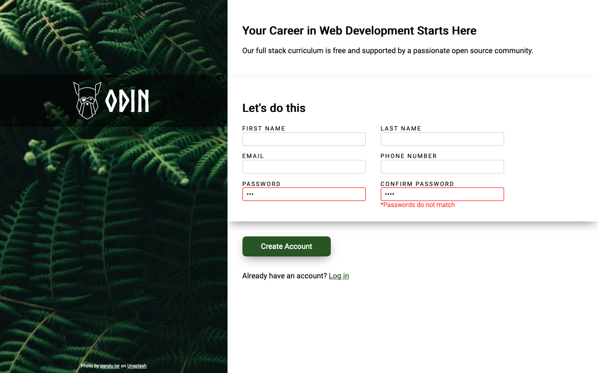
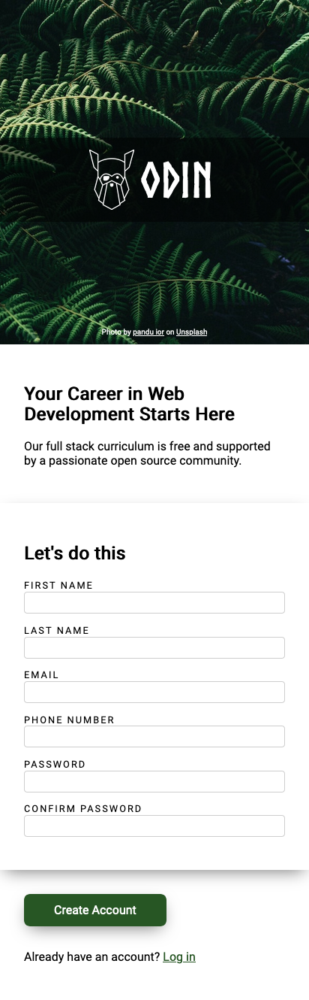

# The Odin Project: Sign Up Form
The Odin Project Course Assignment

- This project is a part of [The Odin Project](https://www.theodinproject.com/paths/full-stack-javascript/courses/intermediate-html-and-css) Intermediate HTML & CSS curriculum

- The goal is to make an example of sign up page, with a responsive layout and simple password validation in Vanilla JS

### Live preview: [link](https://davidtrikic.github.io/sign-up-form/)

## Screenshots

